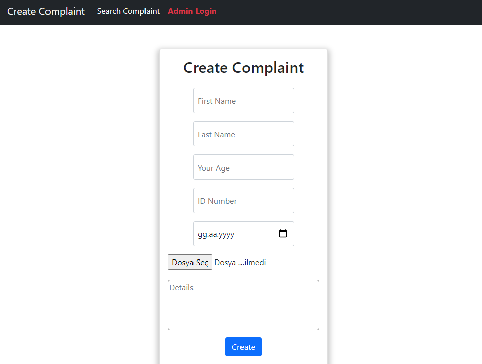

## Bitirme projesi

[Live](https://graduation-project-onursimsekkk.vercel.app/complaint "Ticket App")
---
### Admin Login (/login)

username: kodluyoruz
password: bootcamp109

### Search Test (/search)
Ticket Id: a42a2522-978a-4862-98e6-af946cd5e606
Ticket Id: 710253b1-6cbb-40e4-b3f6-c9a7d2bed820
---

---
#### Genel Açıklama

Uygulamamız herkese açık bir başvuru formunun son kullanıcı tarafından doldurulması ile başlıyor. 
Formu dolduran kullanıcıya başvurusunu takip edebilecegi bir kod veriliyor. Kullanıcı başvuru durumu sayfasından bu kod ile başvurusunun çözülüp çözülemedigini kontrol edebiliyor. 

Kullanıcı adı ve şifre ile girilebilen bir ekrandan da yetkili kullanıcılar gelen başvuruları görüntüleyebiliyor cevaplanmamış başvurulara cevap yazıp durumunu çözüldü / iptal edildi / bekliyor vb gibi güncelleyebiliyor. Gerekirse eski kayıtlara ulaşabiliyor.

#### Kullanılanlar

- React hooks
- React-router
- React Hook Form
- yup
- Firebase - Firestore
- React-bootstrap & Bootstrap
- UUID
- Context API
- Deployment - Vercel
- Eslint

## Getting Started with Create React App

This project was bootstrapped with [Create React App](https://github.com/facebook/create-react-app).

## Available Scripts

In the project directory, you can run:

### `npm start`

Runs the app in the development mode.\
Open [http://localhost:3000](http://localhost:3000) to view it in the browser.

The page will reload if you make edits.\
You will also see any lint errors in the console.

